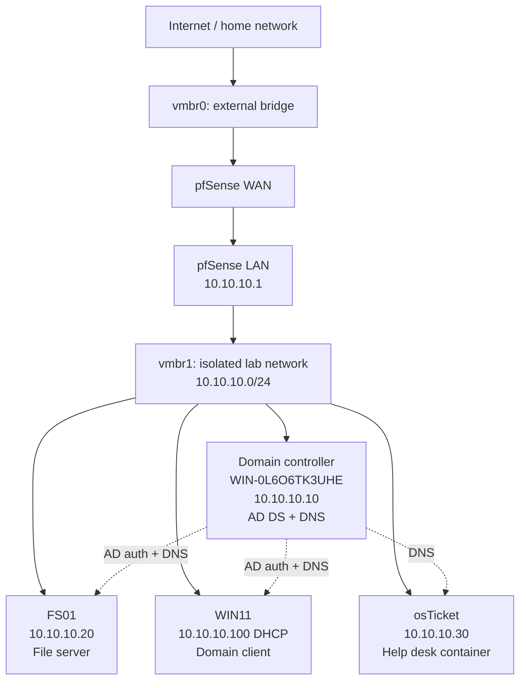

# Enterprise IT Home Lab

I built a small company network on one laptop to learn how IT infrastructure works by actually running it. It has a firewall, an Active Directory domain, a file server, a Windows client, a help desk system, and PowerShell automation.

## Why I built it

I wanted hands-on experience with the things a junior sysadmin works with every day. I set up everything here myself, and I broke and fixed a lot of it along the way. Those fixes are written up in the docs.

## Architecture

**Host:** Proxmox VE on a laptop with one network port. I split the network with two virtual bridges. vmbr0 connects to my home network, and vmbr1 is the isolated lab network. pfSense sits between them as the firewall and router.

## Tech stack

| Layer | Technology |
|---|---|
| Hypervisor | Proxmox VE |
| Firewall / router | pfSense |
| Domain controller | Windows Server 2025 (AD DS, DNS) |
| File server | Windows Server 2025 (member server) |
| Client | Windows 11 |
| Automation | PowerShell |
| Help desk | osTicket 1.18.3 in a Debian 12 container (Apache, PHP 8.2, MariaDB 10.11) |

## What's working

- [x] Isolated lab network behind pfSense
- [x] Active Directory domain (`lab.internal`) with OUs by role and security groups named with a `GG_` prefix
- [x] Windows 11 client joined to the domain
- [x] File server (FS01) with Finance, IT, and Public folders. Access is controlled by AD groups.
- [x] PowerShell script that creates a new employee's account and adds them to their department group
- [x] osTicket help desk at `helpdesk.lab.internal`. The database only accepts local connections, its account can only reach its own database, and the installer is removed.
- [x] Write-ups of problems I ran into and how I fixed them (see Documentation)

## Constraints

The whole lab runs on a 2014 ThinkPad T440s with 8 GB of RAM, and 12 GB is the most it can take. When the host ran out of memory and started swapping, I cut each VM down to what it actually needs and put osTicket in a 512 MB container instead of a full VM.

## Next

- [ ] Group Policy to map department drives automatically
- [ ] Wazuh and Kali Linux to practice detecting attacks

## Documentation

- [Network architecture](docs/01-network-architecture.md)
- [Active Directory design](docs/02-active-directory.md)
- [File server and permissions](docs/03-file-server-permissions.md)
- [Troubleshooting: Proxmox web interface outage](docs/04-troubleshooting-proxmox-outage.md)
- [Troubleshooting: FS01 build problems](docs/05-troubleshooting-fs01-build.md)
- [PowerShell automation](docs/06-powershell-automation.md)
- [Troubleshooting: DNS problems](docs/07-troubleshooting-dns.md)

## Scripts

- [New-Employee.ps1](scripts/New-Employee.ps1): creates an AD user and adds them to their department group

## Screenshots

Screenshots for each part are in the [screenshots folder](screenshots/), grouped by topic.
