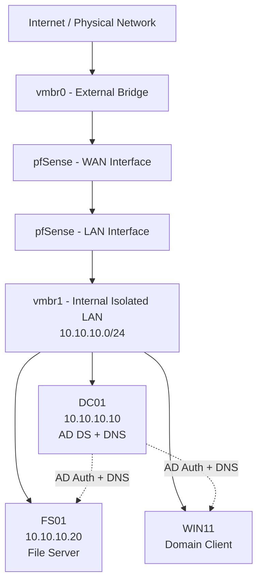

# Enterprise IT Infrastructure Home Lab

A self-built, isolated small-enterprise network — virtualization, network segmentation, Active Directory, file services, and PowerShell automation — designed to mirror how a real small-to-mid-size company's IT infrastructure fits together.

## Why this project exists

I built this to learn enterprise IT infrastructure hands-on rather than just reading about it: virtualization, network segmentation, identity management, file services, and automation, the way a junior sysadmin or network administrator would actually encounter them. Every piece below is something I configured, broke, diagnosed, and fixed myself.

## Architecture

**Host:** Proxmox VE on a single-NIC laptop, with all network segmentation handled virtually through Linux bridges — `vmbr0` (external-facing) and `vmbr1` (isolated internal LAN), with pfSense routing/firewalling between them.

## Tech stack

| Layer | Technology |
|---|---|
| Hypervisor | Proxmox VE |
| Firewall / Router | pfSense |
| Domain Controller | Windows Server 2025 (AD DS, DNS) |
| File Server | Windows Server 2025 (member server) |
| Client | Windows 11 |
| Automation | PowerShell |

## What's built and working

- [x] Isolated network segmentation (Proxmox virtual bridges + pfSense)
- [x] Active Directory domain (`lab.internal`) with a role-based OU structure and a `GG_`-prefixed security group naming convention
- [x] Windows 11 client domain-joined and authenticated
- [x] File server (FS01) with SMB shares and NTFS permissions enforced through AD security groups, department-separated (Finance / IT / Public)
- [x] PowerShell automation: a parameterized new-employee onboarding script (AD account creation + department group assignment)
- [x] Three real troubleshooting incidents, diagnosed and resolved (see `/docs`)

## What's next

- [ ] Group Policy — automatic drive mapping based on department group membership
- [ ] Wazuh SIEM + Kali Linux — security monitoring and detection lab

## Documentation

- [Network Architecture](docs/01-network-architecture.md)
- [Active Directory Design](docs/02-active-directory.md)
- [File Server & Permissions](docs/03-file-server-permissions.md)
- [Troubleshooting: Proxmox Management Interface Outage](docs/04-troubleshooting-proxmox-outage.md)
- [Troubleshooting: FS01 Build Issues](docs/05-troubleshooting-fs01-build.md)
- [Troubleshooting: DNS Resolution Issues](docs/07-troubleshooting-dns.md)
- [PowerShell Automation](docs/06-powershell-automation.md)

## Scripts

- [`New-Employee.ps1`](scripts/New-Employee.ps1) — parameterized AD user provisioning script

## Screenshots

See [`/screenshots`](screenshots/) for evidence organized by topic — network setup, AD structure, the DNS and file-permission troubleshooting sequences, Kerberos ticket verification, and the PowerShell automation build-out.
