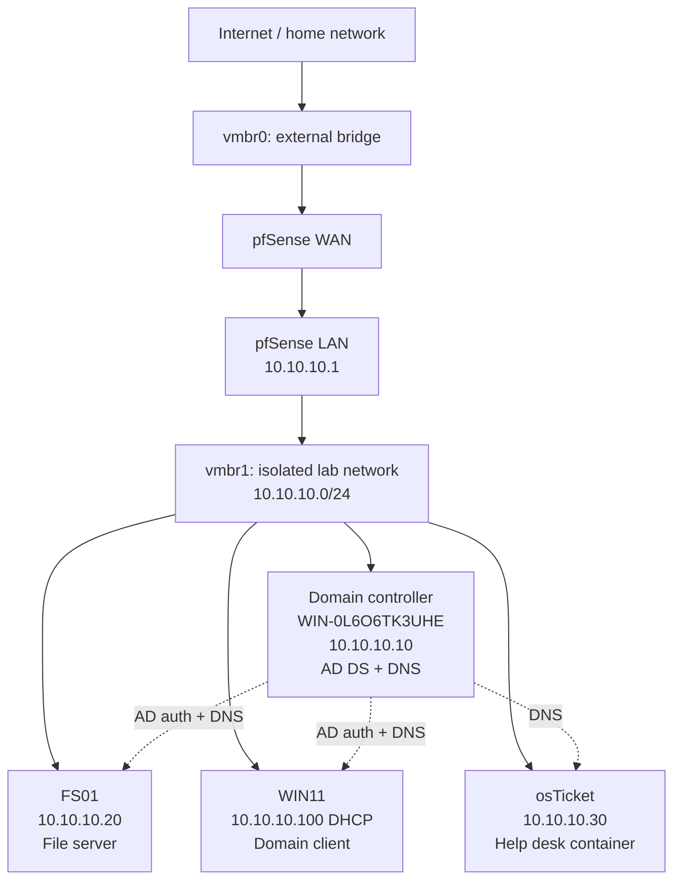

# Enterprise IT Home Lab

A self-hosted lab that replicates the core infrastructure: a segmented network behind a firewall, an Active Directory domain, a departmental file server, a help desk system, and PowerShell automation for user onboarding. The whole environment runs on a single Lenovo Thinkpad Laptop.

## Architecture

**Host:** Proxmox VE on a laptop with one network interface. Two Linux bridges divide the network: vmbr0 connects to my home network, while vmbr1 hosts the isolated lab. pfSense routes and filters all traffic between them.

## Tech Stack

| Layer | Technology |
|---|---|
| Hypervisor | Proxmox VE |
| Firewall / router | pfSense |
| Domain controller | Windows Server 2025 (AD DS, DNS) |
| File server | Windows Server 2025 (member server) |
| Client | Windows 11 |
| Automation | PowerShell |
| Help desk | osTicket 1.18.3 in a Debian 12 container (Apache, PHP 8.2, MariaDB 10.11) |

## Completed Work

- [x] Isolated lab network, with pfSense handling routing, firewall rules, NAT, and DHCP
- [x] Active Directory domain (`lab.internal`) organized into role-based OUs, with department security groups following a `GG_` naming convention
- [x] Windows 11 client joined to the domain to validate logins and access from an end-user perspective
- [x] Member file server (FS01) hosting Finance, IT, and Public shares, with NTFS permissions assigned through AD security groups
- [x] PowerShell onboarding script that provisions a new user account and assigns department group membership
- [x] osTicket help desk at `helpdesk.lab.internal`, hardened by restricting the database to local connections, limiting its service account to a single database, and removing the installer
- [x] Troubleshooting write-ups documenting the root cause and resolution of each major issue
- [x] Self-hosted osTicket help desk (Debian 12 container, Apache/PHP/MariaDB) with an internal DNS record in Active Directory

## Constraints

The lab hosted on a 2014 ThinkPad T440s with 8 GB of RAM, close to the hardware's 12 GB maximum. When the host exhausted its memory, I reduced each VM's allocation to match its workload and deployed osTicket in a 512 MB container instead of a virtual machine.

## Roadmap

- [ ] Group Policy for automatic department drive mapping
- [ ] Wazuh SIEM with Kali Linux for attack simulation and detection

## Documentation

- [Network architecture](docs/01-network-architecture.md)
- [Active Directory design](docs/02-active-directory.md)
- [File server and permissions](docs/03-file-server-permissions.md)
- [Troubleshooting: Proxmox web interface outage](docs/04-troubleshooting-proxmox-outage.md)
- [Troubleshooting: FS01 build issues](docs/05-troubleshooting-fs01-build.md)
- [PowerShell automation](docs/06-powershell-automation.md)
- [Troubleshooting: DNS issues](docs/07-troubleshooting-dns.md)

## Scripts

- [New-Employee.ps1](scripts/New-Employee.ps1): provisions an AD user account and assigns department group membership

## Screenshots

Supporting screenshots for each component are organized by topic in the [screenshots folder](screenshots/).
